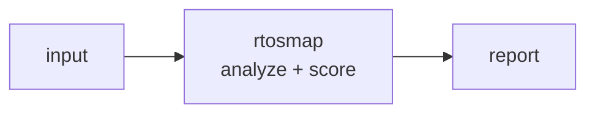

<a name="top"></a>
<div align="center">


# RTOSMAP

### Statically map task structures, stack usage, and ISR call graphs in FreeRTOS/Zephyr firmware to flag stack overflows and priority-inversion risks.


[](https://pypi.org/project/cognis-rtosmap/) [](https://github.com/cognis-digital/rtosmap/actions) [](LICENSE) [](https://github.com/cognis-digital)

*IoT / OT / Embedded — firmware, buses, and device security.*

</div>

```bash
pip install cognis-rtosmap
rtosmap scan .            # → prioritized findings in seconds
```

## Usage — step by step

1. **Install** (Python 3.9+):

   ```bash
   pip install rtosmap            # or: pipx install rtosmap
   ```

2. **Check a stack map.** Point `check` at your RTOS stack map file (or `-` for stdin) to report risky tasks:

   ```bash
   rtosmap check stackmap.txt
   ```

3. **Tune the thresholds.** Adjust the used-percentage at which a task is flagged WARNING (`--warn`, default 80) or CRITICAL (`--fail`, default 90):

   ```bash
   rtosmap check stackmap.txt --warn 70 --fail 85 --format json > stack.json
   ```

   Three output formats are available via `--format`: `table` (default,
   human-readable), `json` (stable contract for scripts/agents), and
   `sarif` (SARIF 2.1.0 for GitHub code-scanning — see below).

4. **Read the result.** The report ranks each task by stack used%, marking WARNING/CRITICAL tiers. In JSON mode, parse the per-task findings; the process exits non-zero on CRITICAL findings.

5. **Gate in CI.** Use `--strict` to also fail on WARNING-level findings:

   ```bash
   rtosmap check stackmap.txt --strict
   ```

## Contents

- [Why rtosmap?](#why) · [Features](#features) · [Quick start](#quick-start) · [Example](#example) · [Demos](#demos) · [SARIF](#sarif) · [Architecture](#architecture) · [AI stack](#ai-stack) · [How it compares](#how-it-compares) · [Integrations](#integrations) · [Install anywhere](#install-anywhere) · [Related](#related) · [Contributing](#contributing)

<a name="why"></a>
## Why rtosmap?

Embedded devs love free static analysis they can drop in PRs — 'this task overflows its stack under load' caught pre-merge. Niche but rabidly loyal embedded GitHub crowd.

`rtosmap` is single-purpose, scriptable, and self-hostable: point it at a target, get prioritized results in the format your workflow already speaks (table · JSON · SARIF), gate CI on it, and let agents drive it over MCP.

<div align="right"><a href="#top">↑ back to top</a></div>

<a name="features"></a>
## Features

- ✅ Parse Map — FreeRTOS / Zephyr / ThreadX stack maps, K/KB/KiB units
- ✅ Analyze — overflow, critical/low headroom, invalid size, unverified
- ✅ Analyze Text — parse + analyze a stack-map string in one call
- ✅ Three outputs — `table` · `json` · **SARIF 2.1.0** (`--format sarif`)
- ✅ Tunable gate — `--warn` / `--fail` thresholds + `--strict` for CI
- ✅ Runs on Linux/macOS/Windows · Docker · devcontainer
- ✅ Ports in Python, JavaScript, Go, and Rust (`ports/`)

<div align="right"><a href="#top">↑ back to top</a></div>

<a name="quick-start"></a>
## Quick start

```bash
pip install cognis-rtosmap
rtosmap --version
rtosmap scan .                       # scan current project
rtosmap scan . --format json         # machine-readable
rtosmap scan . --fail-on high        # CI gate (non-zero exit)
```

<div align="right"><a href="#top">↑ back to top</a></div>

<a name="example"></a>
## Example

```text
$ rtosmap scan .
  [HIGH    ] RTO-001  example finding             (./src/app.py)
  [MEDIUM  ] RTO-002  another signal              (./config.yaml)

  2 findings · risk score 5 · 38ms
```

<div align="right"><a href="#top">↑ back to top</a></div>

<a name="demos"></a>
## Demos — real-world scenarios

Each folder under [`demos/`](demos/) has a stack map in rtosmap's real input
format plus a `SCENARIO.md` explaining where the data came from, what to
expect, the exact command, and how to act. Every demo is exercised by the
test suite, so they always run.

| Demo | RTOS / target | Shows |
|---|---|---|
| [`01-basic`](demos/01-basic/) | FreeRTOS | overflow + low headroom + unverified, default thresholds |
| [`02-zephyr-thread-analyzer`](demos/02-zephyr-thread-analyzer/) | Zephyr (nRF5340 BLE) | converting `CONFIG_THREAD_ANALYZER` output; BLE-controller stacks at risk |
| [`03-esp32-wifi-ble-coex`](demos/03-esp32-wifi-ble-coex/) | ESP-IDF (ESP32-S3) | tuned `--warn 75 --fail 90` for a hot coexistence build |
| [`04-clean-baseline-ci`](demos/04-clean-baseline-ci/) | STM32 FreeRTOS | a known-good map that passes `--strict` (exit 0) as a CI guard |
| [`05-safety-critical-tight`](demos/05-safety-critical-tight/) | IEC 62304 Class C | 50%-headroom policy surfacing overflow, invalid size, and unverified tasks |
| [`06-stdin-pipeline`](demos/06-stdin-pipeline/) | Azure RTOS / ThreadX | pipe a live on-target capture in over stdin (`check -`) |
| [`07-sarif-code-scanning`](demos/07-sarif-code-scanning/) | FreeRTOS (smart meter) | `--format sarif` → GitHub code-scanning annotations |
| [`08-json-triage-jq`](demos/08-json-triage-jq/) | FreeRTOS (industrial gateway) | mixed K/KB/KiB units + JSON/`jq` agent triage |

```bash
python -m rtosmap check demos/02-zephyr-thread-analyzer/threads.map
```

<div align="right"><a href="#top">↑ back to top</a></div>

<a name="sarif"></a>
## SARIF for GitHub code-scanning

`rtosmap check --format sarif` emits a **SARIF 2.1.0** log. Each outcome maps
to a stable rule id (`RTOS-OVERFLOW`, `RTOS-HEADROOM-CRITICAL`,
`RTOS-HEADROOM-LOW`, `RTOS-INVALID-SIZE`, `RTOS-UNVERIFIED`) so code-scanning
can track and suppress findings across runs.

```yaml
# .github/workflows/firmware.yml
- name: rtosmap stack scan
  run: python -m rtosmap check fw/stack.map --format sarif > rtosmap.sarif
  continue-on-error: true
- uses: github/codeql-action/upload-sarif@v3
  with:
    sarif_file: rtosmap.sarif
```

Stack-overflow and low-headroom findings then show up as annotations on the
PR's changed files. See [`demos/07-sarif-code-scanning`](demos/07-sarif-code-scanning/).

<div align="right"><a href="#top">↑ back to top</a></div>

<a name="architecture"></a>
## Architecture



<div align="right"><a href="#top">↑ back to top</a></div>

<a name="ai-stack"></a>
## Use it from any AI stack

`rtosmap` is interoperable with every popular way of using AI:

- **MCP server** — `rtosmap mcp` (Claude Desktop, Cursor, Cognis.Studio, [uncensored-fleet](https://github.com/cognis-digital/uncensored-fleet))
- **OpenAI-compatible / JSON** — pipe `rtosmap scan . --format json` into any agent or LLM
- **LangChain · CrewAI · AutoGen · LlamaIndex** — wrap the CLI/JSON as a tool in one line
- **CI / scripts** — exit codes + SARIF for non-AI pipelines

<div align="right"><a href="#top">↑ back to top</a></div>

<a name="how-it-compares"></a>
## How it compares

| | **Cognis rtosmap** | Ghidra scripting + percepio Tracealyzer |
|---|:---:|:---:|
| Self-hostable, no account | ✅ | varies |
| Single command, zero config | ✅ | ⚠️ |
| JSON + SARIF for CI | ✅ | varies |
| MCP-native (AI agents) | ✅ | ❌ |
| Polyglot ports (JS/Go/Rust) | ✅ | ❌ |
| Open license | ✅ COCL | varies |

*Built in the spirit of **Ghidra scripting + percepio Tracealyzer**, re-framed the Cognis way. Missing a credit? Open a PR.*

<div align="right"><a href="#top">↑ back to top</a></div>

<a name="integrations"></a>
## Integrations

Pipes into your stack: **SARIF** for code-scanning, **JSON** for anything, an **MCP server** (`rtosmap mcp`) for AI agents, and a webhook forwarder for SIEM/Slack/Jira. See [`docs/INTEGRATIONS.md`](docs/INTEGRATIONS.md).

<div align="right"><a href="#top">↑ back to top</a></div>

<a name="install-anywhere"></a>
## Install — every way, every platform

```bash
pip install "git+https://github.com/cognis-digital/rtosmap.git"    # pip (works today)
pipx install "git+https://github.com/cognis-digital/rtosmap.git"   # isolated CLI
uv tool install "git+https://github.com/cognis-digital/rtosmap.git" # uv
pip install cognis-rtosmap                                          # PyPI (when published)
docker run --rm ghcr.io/cognis-digital/rtosmap:latest --help        # Docker
brew install cognis-digital/tap/rtosmap                             # Homebrew tap
curl -fsSL https://raw.githubusercontent.com/cognis-digital/rtosmap/main/install.sh | sh
```

| Linux | macOS | Windows | Docker | Cloud |
|---|---|---|---|---|
| `scripts/setup-linux.sh` | `scripts/setup-macos.sh` | `scripts/setup-windows.ps1` | `docker run ghcr.io/cognis-digital/rtosmap` | [DEPLOY.md](docs/DEPLOY.md) (AWS/Azure/GCP/k8s) |

<div align="right"><a href="#top">↑ back to top</a></div>

<a name="related"></a>
## Related Cognis tools

- [`fwxray`](https://github.com/cognis-digital/fwxray) — Diff two firmware images and surface exactly what changed: new binaries, flipped config flags, added certs, and shifted entropy regions.
- [`canzap`](https://github.com/cognis-digital/canzap) — Replay, fuzz, and assert on CAN bus traffic from a .pcap or SocketCAN interface with a tiny YAML DSL.
- [`sbomb`](https://github.com/cognis-digital/sbomb) — Generate a CycloneDX SBOM directly from an unpacked firmware root filesystem and flag components with known CVEs and EOL kernels.
- [`mqttspy`](https://github.com/cognis-digital/mqttspy) — Passively map an MQTT broker: enumerate topics, detect unauthenticated writes, spot PII/secrets in payloads, and emit a risk report.
- [`uefiscan`](https://github.com/cognis-digital/uefiscan) — Audit UEFI firmware dumps for missing Secure Boot keys, unsigned modules, S3 boot-script vulns, and known SMM threats.
- [`modpot`](https://github.com/cognis-digital/modpot) — Spin up a high-interaction Modbus/DNP3 ICS honeypot that logs attacker register reads/writes as structured JSON.

**Explore the suite →** [🗂️ all 170+ tools](https://github.com/cognis-digital/cognis-neural-suite) · [⭐ awesome-cognis](https://github.com/cognis-digital/awesome-cognis) · [🔗 cognis-sources](https://github.com/cognis-digital/cognis-sources) · [🤖 uncensored-fleet](https://github.com/cognis-digital/uncensored-fleet) · [🧠 engram](https://github.com/cognis-digital/engram)

<div align="right"><a href="#top">↑ back to top</a></div>

<a name="contributing"></a>
## Contributing

PRs, new rules, and demo scenarios are welcome under the collaboration-pull model — see [CONTRIBUTING.md](CONTRIBUTING.md) and [SECURITY.md](SECURITY.md).

> ### ⭐ If `rtosmap` saved you time, **star it** — it genuinely helps others find it.

## Interoperability

`{}` composes with the 300+ tool Cognis suite — JSON in/out and a shared
OpenAI-compatible `/v1` backbone. See **[INTEROP.md](INTEROP.md)** for the
suite map, composition patterns, and reference stacks.

## License

Source-available under the **Cognis Open Collaboration License (COCL) v1.0** — free for personal, internal-evaluation, research, and educational use; **commercial / production use requires a license** (licensing@cognis.digital). See [LICENSE](LICENSE).

---

<div align="center"><sub><b><a href="https://cognis.digital">Cognis Digital</a></b> · one of 170+ tools in the <a href="https://github.com/cognis-digital/cognis-neural-suite">Cognis Neural Suite</a> · <i>Making Tomorrow Better Today</i></sub></div>
